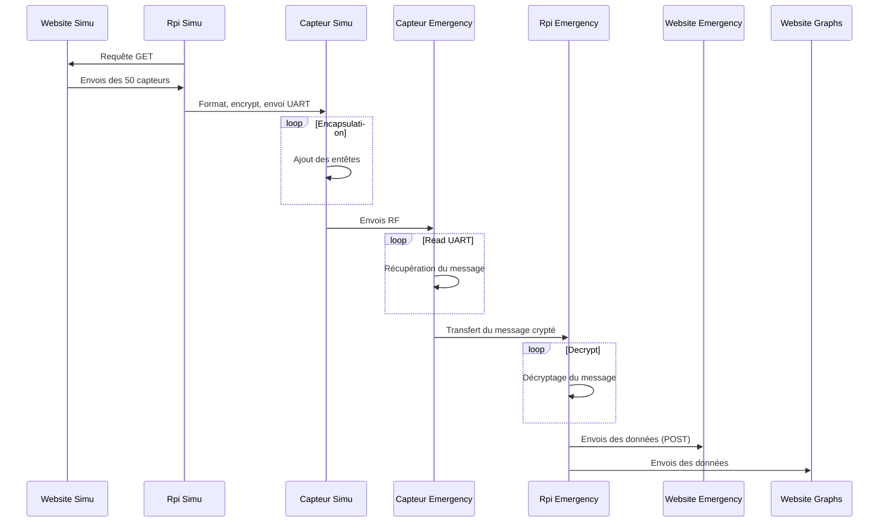

# Projet Transversal 4IRC

Membres : 
* Antoine Gamain (https://github.com/Fyndir)
* Tom Blanchet (https://github.com/frontBOI)
* léo Meynet (https://github.com/Neexos)
* Lucas Philippe (https://github.com/Tenebry)

## Contexte

Ce projet consiste à simuler des incendies sur une ville, et leur prise en charge par les flottes d’urgence qui vont intervenir.

le projet se découpe en plusieurs briques : 

* Le réseau Virtuel (https://github.com/Tenebry/Network_On_Fire):

Le but de cette brique est de recreer l'environnement informatique des casernes avec des LAN virtuel interconnecté via une backbone. C'est depuis des VM branchées sur ce réseau que l'on peux accèder à l'ensemble des services.

* Le centre de simulation (https://github.com/Fyndir/ClientJavaSimulation) : 

Son rôle est de générer des feux dont les coordonnées, l’intensité et la fréquence sont à définir dans le programme. Ces données sont par la site transmit au serveur Flash de simulation à l'aide d'une API mise à disposition par le dit serveur.
Par la site la gestion des déplacements des camions sera également gérer par ce programme et sera envoyée sur le serveur de l'emergencyManager à l'aide d'une API mis à disposition par celui-ci.

* Le serveur de simulation (https://github.com/Fyndir/FireSimulation) :

Son role est d'afficher la simulation en temps réel pour voir l'état des feu sur une map. Il permet également de récuper les données à un instant T grace a une URL qui renvoi les données sous un format prédéfinies.

* La brique IOT (https://github.com/Neexos/ProjectTrans):

Son role est de transmettre les information du serveur de simulation au serveur d'emergency manager à l'aide de deux microcontrolleur , 2 rasberry et d'APIs developées sur les deux serveurs.

* Le serveur Emergency Manager (https://github.com/Fyndir/EmergencyManager):

Son role est d'inserer les données qu'il recoit dans la base de données à l'aide d'API. Il permet également d'afficher en temps réel le contenu de la base (feu / déplacement des camions)

* La base de données de l'emergency Manager (https://github.com/Fyndir/BddEmergencyManager)): 

Son role est de stocker les données des feux et d'affecté les camions au dit feux à l'aide d'un ensemble de trigger SQL

# Chaîne IoT
La chaîne IoT se compose de 2 microcontrôleurs branchés sur une RaspberryPi chacun.
Nous somme partis sur une architecture où les microcontrôleurs n'ont pas (ou presque) d'intelligence. Le Raspberry côté simulation fait des requête afin d'obtenir les informations sur les feux en cours, il crypte les données et les formate pour les envoyer au microcontrôleur. Ce dernier récupère les données cryptées, ajoute une entête et envois les données au microcontrôleur côté emergencyManager.
De ce côté le microcontrôleur analyse l'entête et vérifie que le paquet lui est destiné auquel cas il se charge d'envois les données à sa Raspberry. Cette dernière lit les données, les décrypte puis les envois à l'emergencyManager et à la base IoT.

Du côté Emergency, 3 processus travaillent simultanément sur la Raspberry:
 - Le premier lis sur l'UART en continue et les stock dans 2 Queues afin d'éviter de perdre des données.
 - Le second lis sur la première Queue et envois les données en POST sur le serveur de l'EmergencyManager.
 - Le dernier lis sur la deuxième Queue et envois les données au serveur affichant les graphs (ex: moyenne d'intensité des feux sur tous les capteurs)
